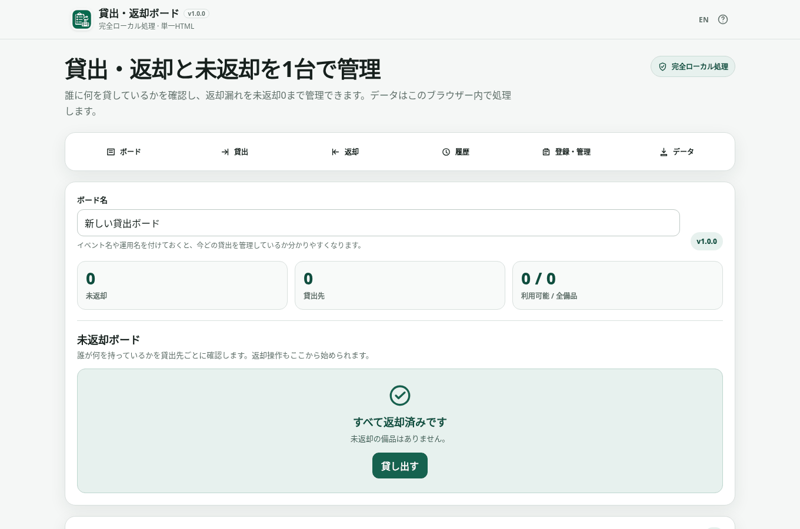

# Loan Board / 貸出・返却ボード

[](https://github.com/ttomohisa/htmlapps-loan-board/actions/workflows/deploy-pages.yml)
[](LICENSE)
[](https://ttomohisa.github.io/htmlapps-loan-board/)

[English README](README.md)

イベント、学校、撮影現場、舞台、社内行事などの短期貸出で、**誰が何を持っていて、何がまだ返ってきていないか**を1台の端末で確認する、完全ローカル処理の貸出・返却ボードです。

## 🚀 デモ

### [GitHub PagesでLoan Boardを開く](https://ttomohisa.github.io/htmlapps-loan-board/)

GitHub Pagesから最初のHTMLを読み込んだ後、備品・貸出先・貸出状態・履歴・バックアップ・CSVはブラウザー内で処理されます。Loan Boardへ入力したユーザーデータをアプリから外部サーバーへ送信しません。

[](https://ttomohisa.github.io/htmlapps-loan-board/)

## 主な機能

- **誰が何を持っているかを未返却ボードで確認** — 貸出先ごとに現在の未返却備品をまとめて確認できます。
- **複数備品をまとめて貸出** — 受付で貸出先を選び、利用可能な備品を複数選択して一度に記録できます。
- **全返却 / 部分返却** — 一部返却では備品名・カテゴリ・コードで検索できます。検索で非表示になった選択も保持し、その件数を表示します。
- **返却漏れを「未返却 0」まで管理** — すべて戻ったときは完了状態を明確に表示します。
- **連番の備品をまとめて登録** — 「無線機 01〜20」のような個体を、番号・桁数・管理コード付きで一括作成できます。
- **直前操作のUndoと履歴** — Checkout / Return / Undoを履歴として残し、現在状態と整合する直前操作だけを元に戻せます。
- **ブラウザー内へ自動保存** — 再読み込み後も保存データを検証して復元します。
- **JSONバックアップ / 復元** — Board、備品、貸出先、貸出状態、履歴をまとめて退避・復元できます。
- **CSV出力** — 未返却一覧、操作履歴、備品一覧をExcel等で確認・集計できます。
- **PC / スマートフォン・日本語 / 英語** — 1台の受付端末で使いやすいUIを用意しています。
- **単一HTML・実行時外部通信なし** — 必要なアプリコードをHTMLへ内包し、CSPで `connect-src 'none'` を指定します。

## すぐに使う

### Webで使う

[GitHub PagesでLoan Boardを開く](https://ttomohisa.github.io/htmlapps-loan-board/)だけで利用できます。インストールやアカウント登録は不要です。

### 単一HTMLを直接使う

[loan-board.html](loan-board.html) をリポジトリからダウンロードして、最新のChromiumベースブラウザ、Firefox、Safariで開いてください。

### 自分でビルドする

1. このリポジトリをダウンロードまたはクローンします。
2. Windowsで `build-standalone.bat` を実行します。
3. `dist/index.html`, `dist/index.self-extract.html`, `loan-board.html` が生成されます。
4. 生成したHTMLをブラウザで開きます。

このアプリは外部ライブラリを使用していないため、通常のビルドで追加パッケージの取得は発生しません。Python、Node.js、ローカルWebサーバーは不要です。

## 使い方

ヘッダーのEN / JAで言語を切り替えます。貸出状態と一部返却の検索・選択は保持されます。

1. ボード名にイベント名や運用名を入力します。
2. 「登録・管理」で備品を登録します。多数の同種備品は「連番をまとめて登録」を使えます。
3. 必要に応じて貸出先を登録します。貸出操作中に新しい貸出先をその場で追加することもできます。
4. 「貸出」で貸出先と複数の備品を選び、貸出を確定します。
5. 「未返却ボード」で、現在誰が何を持っているかを確認します。
6. 返却時は「全返却」または「一部だけ返却」を使います。一部返却の検索対象は選択した貸出先の未返却備品だけです。検索で非表示になった選択も返却総数に含まれます。貸出先の変更やキャンセルで検索と選択を解除します。
7. 最後に「未返却 0」を確認します。

### Undo

貸出・返却直後の通知から、現在の状態と整合する直前操作だけを元に戻せます。

Undoしても元の履歴は削除しません。元Eventを残したままUndo Eventを追加します。

### 備品のアーカイブ

使わなくなった備品は削除ではなくアーカイブできます。

アーカイブした備品は貸出候補から外れますが、過去の履歴は残ります。貸出中の備品は返却してからアーカイブしてください。

復元したバックアップにアーカイブ済み貸出先の未返却備品が含まれる場合も、返却が終わるまでボードと返却欄に表示します。貸出先のアーカイブ状態は維持し、新たな貸出候補には含めません。

## 保存・バックアップ

### 自動保存

Board、備品、貸出先、現在の貸出状態、履歴、アーカイブ状態をこのブラウザーへ自動保存します。

保存データを読み込めない場合、空データで既存の保存内容を自動上書きしません。JSONバックアップから復元するか、明示的に新しいボードへリセットしてください。

### JSONバックアップ

JSONは **Loan Board全体を復元するための形式**です。

復元時はformat、schema、ID、参照関係、貸出状態を確認し、問題がなければ現在のボードを置き換える確認を表示します。

### CSV

次の3種類を保存できます。

- 未返却一覧CSV
- 操作履歴CSV
- 備品一覧CSV

CSVはUTF-8 BOM付き、CRLF、全セルquoteで出力します。ユーザー入力が `=`, `+`, `-`, `@` などで始まる場合は、表計算ソフトで数式として評価されにくい形へ保護します。

**CSVは確認・集計用で、完全復元用のバックアップではありません。**

## スマートフォン

上部の操作ナビから「ボード / 貸出 / 返却 / 履歴 / 登録・管理 / データ」へ移動できます。

狭い画面ではナビやフォームが折り返され、ダイアログは画面下から表示されます。固定の下部バーは使わないため、コンテンツを隠しません。


## GitHub Pagesで公開する

このリポジトリには、standalone HTMLをビルドしてGitHub Pagesへ公開するworkflowが含まれています。

1. **Settings → Pages → Build and deployment → Source** で **GitHub Actions** を選択します。
2. `main` へpushするか、Actionsから **Deploy standalone app to GitHub Pages** を実行します。
3. repository checkとstandalone buildが成功するとPagesへ公開されます。

公開URL:

[https://ttomohisa.github.io/htmlapps-loan-board/](https://ttomohisa.github.io/htmlapps-loan-board/)

## 開発とビルド

```text
.
├─ src/index.template.html       # アプリ本体
├─ assets/favicon.svg            # favicon / header icon
├─ app.config.json               # 名前・version・build設定
├─ APP_SPEC.md                   # 仕様
├─ RELEASE_CHECKLIST.md          # v1.0.0回帰項目
├─ build-standalone.bat          # Windows用build入口
├─ build-standalone.ps1          # standalone HTML builder
├─ scripts/check-repository.ps1  # repository / build検証
└─ .github/workflows/
   ├─ build-standalone.yml       # Pull Request build
   ├─ preview.yml                # Cloudflare PR Preview
   └─ deploy-pages.yml           # main → GitHub Pages
```

PowerShellとNode.js 18以上を使ったローカル検証:

```powershell
powershell.exe -NoLogo -NoProfile -ExecutionPolicy Bypass -File .\scripts\check-powershell-syntax.ps1
powershell.exe -NoLogo -NoProfile -ExecutionPolicy Bypass -File .\scripts\check-repository.ps1
```

repository checkでは合成データとDOMモデルによる回帰テストを、source・root HTML・通常版・自己展開版の復元内容に対して実行します。実ブラウザーのキーボード・レイアウト・ダウンロード・オフライン確認は別途必要です。

buildでは `dist/index.html`, `dist/index.self-extract.html`, `loan-board.html` を生成し、外部runtime参照、未解決placeholder、CSP、favicon/header iconなどを検査します。

## プライバシーと通信

Loan Boardは備品名、貸出先、貸出状態、履歴、JSON、CSVを端末内で処理します。

生成HTMLには `connect-src 'none'` を含むContent Security Policyを設定し、実行時の外部通信を許可しません。

GitHub Pages版ではページを開くためのHTML配信は発生しますが、Loan Boardへ入力したユーザーデータはアプリから送信されません。

## 制限事項

- 複数端末間の同期には対応していません。
- 予約、返却期限、延長、通知には対応していません。
- 請求・決済を行うレンタル業務向けシステムではありません。
- QRコード / バーコード読み取りには対応していません。
- 自動保存はブラウザーの保存領域を使うため、site data削除、private browsing、`file://` の扱いなどによって利用できなくなる場合があります。
- 重要な運用ではJSONバックアップを併用してください。
- CSVからLoan Board全体を復元することはできません。
- v1.0.0は1台の端末で行う短期貸出を主な対象としています。

## 使用ライブラリ

v1.0.0のアプリruntimeは外部ライブラリを使用していません。ブラウザーAPIとsystem fontを直接利用します。

詳細は [THIRD_PARTY_NOTICES.md](THIRD_PARTY_NOTICES.md) を確認してください。

## コントリビューション

バグ報告や機能提案はGitHub Issuesからお願いします。開発への参加方法は [CONTRIBUTING.md](CONTRIBUTING.md) を確認してください。

## ライセンス

Copyright © 2026 ttomohisa

このプロジェクトは [MIT License](LICENSE) で公開されています。
