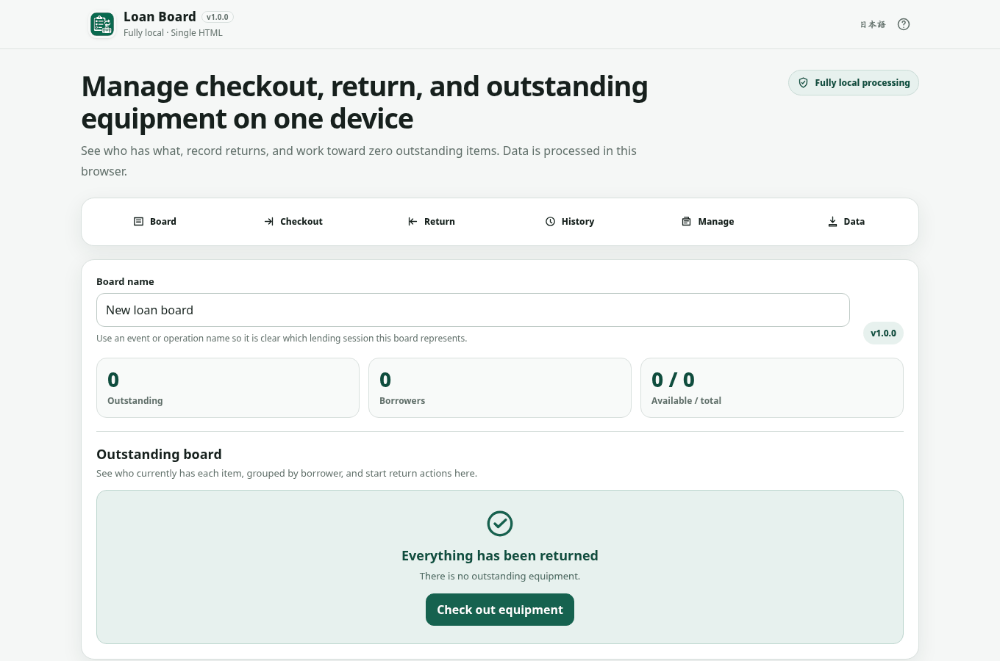

# Loan Board

[](https://github.com/ttomohisa/htmlapps-loan-board/actions/workflows/deploy-pages.yml)
[](LICENSE)
[](https://ttomohisa.github.io/htmlapps-loan-board/)

[日本語版 README](README.ja.md)

A fully local, single-HTML equipment checkout and return board for short-term lending at events, schools, shoots, stages, clubs, and internal activities. It keeps the central question visible: **who has what, and what has not come back yet?**

## 🚀 Live demo

### [Open Loan Board on GitHub Pages](https://ttomohisa.github.io/htmlapps-loan-board/)

GitHub Pages delivers the initial HTML. After it loads, equipment, borrowers, loan state, history, backups, and CSV exports are processed in the browser. The app does not send the user data entered into Loan Board to an external server.

[](https://ttomohisa.github.io/htmlapps-loan-board/)

## Features

- **See who still has equipment** — The outstanding board groups currently checked-out items by borrower.
- **Check out multiple items at once** — Choose a borrower and several available items in one operation.
- **Return everything or only what came back** — Search partial-return items by name, category, or code. Selections stay selected when hidden by the search, with a visible hidden-selection count.
- **Work toward a clear outstanding-zero state** — The board shows a distinct completion state when everything has been returned.
- **Create numbered equipment in batches** — Register sets such as Radio 01–20 with configurable numbering and optional item-code prefixes.
- **Undo the latest compatible operation** — Checkout / Return / Undo remain visible in history; Undo does not erase the original event.
- **Autosave in the browser** — Saved data is validated before it is restored after reload.
- **JSON backup / restore** — Export and restore the complete board state, including current loans and history.
- **CSV exports** — Save outstanding equipment, operation history, or the complete equipment list for spreadsheet review.
- **Desktop / mobile and Japanese / English** — Designed for one front-desk device without requiring an account or installation.
- **Single HTML with no runtime network access** — The generated app uses a CSP containing `connect-src 'none'`.

## Quick start

### Use the web demo

Just [open Loan Board on GitHub Pages](https://ttomohisa.github.io/htmlapps-loan-board/). No installation or account is required.

### Use the standalone HTML directly

Download [loan-board.html](loan-board.html) from this repository and open it in a current Chromium-based browser, Firefox, or Safari.

### Build it yourself

1. Download or clone this repository.
2. Run `build-standalone.bat` on Windows.
3. The build creates `dist/index.html`, `dist/index.self-extract.html`, and `loan-board.html`.
4. Open the generated HTML in your browser.

The v1.0.0 runtime has no third-party library dependency, so the normal app build does not need to download additional packages. Python, Node.js, and a local web server are not required.

## Usage

Use EN / JA in the header to switch languages. Loans and partial-return search and selections stay unchanged.

1. Give the board an event or operation name.
2. Register equipment under Manage. Use numbered batch creation for sets of similar physical items.
3. Add borrowers as needed, or create a new borrower directly during checkout.
4. In Checkout, choose a borrower and one or more available items.
5. Use the outstanding board to see who currently has each item.
6. Return everything at once or select only the items that came back. In partial return, search within that borrower’s current loans; the Return button includes all selected items, even those hidden by the search. Changing borrower or cancelling clears the search and selection.
7. Finish by confirming that the outstanding count is zero.

### Undo

Immediately after checkout or return, the latest compatible operation can be undone.

Undo keeps the original history entry and adds a separate Undo event rather than deleting history.

### Equipment archive

Archive equipment you no longer use instead of deleting it.

Archived equipment is removed from checkout choices while its previous history remains available. Checked-out equipment must be returned before it can be archived.

If a restored backup contains an archived borrower with outstanding loans, those loans remain visible and returnable until returned. The borrower stays archived and is not offered for new checkouts.

## Persistence and backup

### Browser autosave

Board, equipment, borrowers, current loan state, history, and archive state are automatically saved in this browser.

If stored data is malformed, Loan Board does not automatically overwrite it with an empty state. Restore a JSON backup or explicitly reset to a new board.

### JSON backup

JSON is the **full-state restore format**.

Restore validates the backup format, schema, IDs, references, and loan state before asking for confirmation to replace the current board.

### CSV

Three exports are available:

- Outstanding CSV
- Operation history CSV
- Equipment CSV

CSV uses UTF-8 with BOM, CRLF line endings, and quoted cells. User-entered values beginning with formula-triggering characters such as `=`, `+`, `-`, or `@` are protected before export.

**CSV is for review and analysis, not complete Loan Board restoration.**

## Mobile

The operation navigation jumps to Board, Checkout, Return, History, Manage, and Data.

On narrow screens, navigation and forms wrap, and dialogs use a bottom-sheet layout. There is no fixed bottom bar covering page content.


## Publish with GitHub Pages

This repository includes a workflow that builds the standalone HTML and deploys it to GitHub Pages.

1. Open **Settings → Pages → Build and deployment → Source** and select **GitHub Actions**.
2. Push to `main`, or run **Deploy standalone app to GitHub Pages** from Actions.
3. After repository validation and standalone build succeed, Pages publishes the app.

Published URL:

[https://ttomohisa.github.io/htmlapps-loan-board/](https://ttomohisa.github.io/htmlapps-loan-board/)

## Development and build layout

```text
.
├─ src/index.template.html       # Application source
├─ assets/favicon.svg            # Favicon / header icon
├─ app.config.json               # App metadata and build settings
├─ APP_SPEC.md                   # Product specification
├─ RELEASE_CHECKLIST.md          # v1.0.0 regression matrix
├─ build-standalone.bat          # Windows build entry point
├─ build-standalone.ps1          # Standalone HTML builder
├─ scripts/check-repository.ps1  # Repository / build validation
└─ .github/workflows/
   ├─ build-standalone.yml       # Pull request validation
   ├─ preview.yml                # Cloudflare PR Preview
   └─ deploy-pages.yml           # main → GitHub Pages
```

Run local validation with PowerShell and Node.js 18 or newer:

```powershell
powershell.exe -NoLogo -NoProfile -ExecutionPolicy Bypass -File .\scripts\check-powershell-syntax.ps1
powershell.exe -NoLogo -NoProfile -ExecutionPolicy Bypass -File .\scripts\check-repository.ps1
```

The repository check also runs synthetic state/DOM regressions against the source, root HTML, readable build, and decoded self-extract build. These checks do not replace browser keyboard, layout, download, or offline testing.

The build generates `dist/index.html`, `dist/index.self-extract.html`, and `loan-board.html`, then verifies external runtime references, unresolved placeholders, CSP, and the canonical favicon / header icon.

## Privacy and runtime network protection

Loan Board processes equipment, borrower, loan state, history, JSON, and CSV data on the device.

The generated HTML uses a Content Security Policy containing `connect-src 'none'`, so the app does not make runtime network requests.

The GitHub Pages version requires the initial HTML delivery, but user data entered into Loan Board is not sent by the app.

## Limitations

- No synchronization across multiple devices.
- No reservations, due dates, extensions, or notifications.
- Not a billing or payment system for commercial rental operations.
- No QR-code or barcode scanning in v1.0.0.
- Browser autosave can become unavailable after clearing site data, in private browsing, or depending on browser-specific `file://` storage behavior.
- Keep JSON backups for important operations.
- CSV cannot restore the complete Loan Board state.
- v1.0.0 is primarily designed for short-term lending managed on one device.

## Dependencies

The v1.0.0 app runtime uses no third-party library code. It uses browser APIs and system fonts directly.

See [THIRD_PARTY_NOTICES.md](THIRD_PARTY_NOTICES.md) for details.

## Contributing

Bug reports and feature proposals are welcome through GitHub Issues. See [CONTRIBUTING.md](CONTRIBUTING.md) for development guidance.

## License

Copyright © 2026 ttomohisa

Licensed under the [MIT License](LICENSE).
